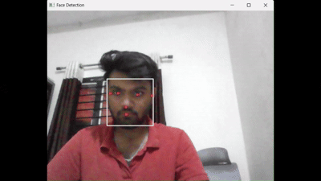

# Hand Detection using OpenCV & MediaPipe

This project features a real-time hand detection and joint-tracking program built using Python, OpenCV, and MediaPipe. It captures live video from your webcam, identifies key hand landmarks, and draws skeletal connections across the joints in real time.

# 📸 Demo 


# 📦 What to Download & Install

Before running the code, make sure you have Python 3.12.10 installed on your computer.

Install the required Python libraries by running this command in your terminal or Git Bash:

```bash
pip install opencv-python mediapipe==0.10.21

---

# Face Detection using OpenCV & MediaPipe

This project features a real-time face detection program built using Python and OpenCV. It captures live video from your webcam, detects faces in real time, and draws bounding boxes around the detected faces.

# 📸 Demo 



# 📦 What to Download & Install

Before running the code, make sure you have Python 3.12.10 installed on your computer.

Install the required Python library by running this command in your terminal or Git Bash:

```bash
pip install opencv-python mediapipe==0.10.21
